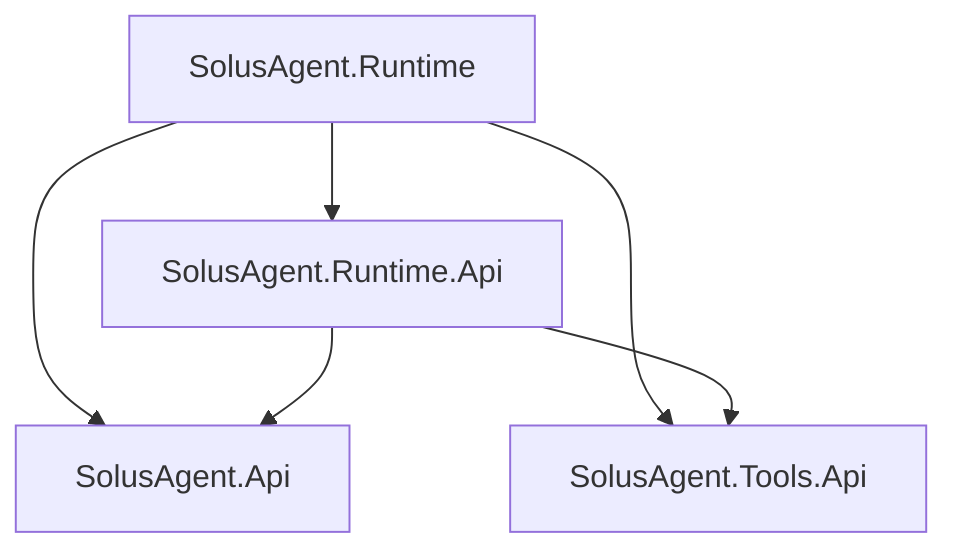

# Project structure

The four production libraries retain the selected dependency boundaries. `SolusAgent.Api` contains the executable outer [execution draft](drafts/agent-execution.md), and `SolusAgent.Tools.Api` contains the [prepared function-tool draft](drafts/function-tools.md); Runtime.Api contains the provider exchange draft; Runtime remains an implementation skeleton. Under `tests/`, one managed runner holds Architecture, Execution, Usage, Candidates, Tools and Providers tests, while separate Api-only custom-agent, CustomTools, CustomProvider and ScribeHost libraries provide their actual independent compile boundaries. No production providers, adapters, generators or runtime loop are included.

## Layout

The [runtime configuration and exposure draft](drafts/runtime-configuration.md) lives in `SolusAgent.Runtime.Api/Configuration` and `/Exposure`. Its actual finite protocol, provider and interface-tool fixtures compile in the existing CustomProvider library; RuntimeConfiguration tests use the existing runner. It adds no project, package, solution registration or production reference edge, and no implementation to Runtime.

The outer [candidate-feedback draft](drafts/candidate-feedback.md) lives in `SolusAgent.Api/Candidates`. Its actual producer and Host consumer compile in the existing Api-only library; Candidates tests use the existing runner. It introduces no project, package, solution registration or production reference edge.

The [context envelope draft](drafts/context-envelope.md) lives in `SolusAgent.Api/Context`. Its actual synthetic producer and call-scoped restricted Host sink compile in the existing Api-only library; Context tests use the existing runner with no new project, package or reference edge.

```text
SolusAgent.slnx
src/
    SolusAgent.Api/
    SolusAgent.Tools.Api/
    SolusAgent.Runtime.Api/
    SolusAgent.Runtime/
tests/
    SolusAgent.ApiOnlyConsumer/
    SolusAgent.ContractTests/
    ConsumerProbes/
        CustomTools/
        CustomProvider/
        ScribeHost/
.github/
    workflows/          # Ordinary CI
docs/
    00_project/
    10_workflow/
    20_architecture/
    50_ai/
    90_roadmap/
    shared/             # Pinned Solus Book submodule
```

Shared engineering guidance and its resources are loaded from the handbook submodule. [Shared handbook adoption](../00_project/shared-handbook.md) owns initialization and the selected revision; the remaining documentation directories retain project requirements.

The XML solution format follows ContractScribe's .NET solution layout. All four projects are ordinary `net10.0` libraries. Managed execution is the default; the shared build configuration does not require Native AOT or trimming.

## Assembly responsibilities

| Project / assembly / root namespace | Owns when implemented | Must not own |
| --- | --- | --- |
| `SolusAgent.Api` | Outer agent execution contracts, requests, results, events, usage, capabilities, and context envelopes. | A concrete runtime, model SDK, provider wire format, or mandatory tool registry. |
| `SolusAgent.Tools.Api` | Reusable function-tool definitions, metadata, input preparation, invocation, and result contracts. | A specific agent SDK, model provider, execution loop, or product evidence model. |
| `SolusAgent.Runtime.Api` | Self-owned runtime extension contracts, including model exchange, runtime configuration, and supported integration hooks. | Runtime execution implementation or product-specific review and documentation contracts. |
| `SolusAgent.Runtime` | Self-owned loop, per-run enforcement, context handling, and integration with shared tools and model providers. | Product result acceptance, campaign ownership, GitHub publication, or host storage policy. |

Project filenames and output DLLs use these exact names. Root namespaces and assembly names use the SDK defaults rather than separate aliases. Distribution metadata will be planned later.

## Reference graph

Arrows mean a direct project reference:



`SolusAgent.Api` and `SolusAgent.Tools.Api` have no project references or external package dependencies. Neither may reference `Runtime.Api` or `Runtime`. `Runtime.Api` may reference the two independent APIs, but must not reference the implementation.

Downstream product source, repository snapshots, fixtures, and machine-local paths must not become shared project references or linked build inputs.

`tests/SolusAgent.ContractTests` is the sole managed test runner and classifies as test-only. It declares the current runner packages with private runner assets and references `SolusAgent.Api`, `SolusAgent.Tools.Api`, `SolusAgent.Runtime.Api` and the four test-only consumer libraries for its actual executable tests. Its Architecture tests evaluate MSBuild project paths and keep the production reference graph and current test registrations exact. Execution, Usage, Candidates, Tools and Providers tests call actual contract types. Future focused tests use this same runner and add only dependencies required by implemented tests.

`tests/SolusAgent.ApiOnlyConsumer` is a non-packable test library with Api as its only production reference and no packages; it contains synthetic execution and [usage](drafts/usage.md) agents and their consumer orchestration through `IAgent`. Evaluated graph and compiled assembly checks preserve this independent boundary even though the common runner also references Tools.Api.

`tests/ConsumerProbes/CustomTools` is a real test-only library, registered in the solution, with Tools.Api as its sole production reference and no package dependencies. It implements a synthetic counter tool and narrow capability. Evaluated architecture assertions check its exact edge, managed target and repository-contained compile inputs. Its effects are confined to test memory; it is not a production tool adapter or another test runner.

`tests/ConsumerProbes/CustomProvider` is a non-packable test-only library with Runtime.Api as its sole direct production reference and no packages. It uses the accepted Tools/Usage types transitively through Runtime.Api and never references Runtime. Providers tests exercise its finite model/tool exchange and actual all-member tool admission; Architecture checks evaluate its exact graph, compiled references and repository-contained sources. Runtime.Api generates XML documentation with warnings-as-errors for the [provider exchange draft](drafts/provider-exchange.md).

`tests/ConsumerProbes/ScribeHost` is a non-packable test-only library, registered in the solution, with Api as its sole production reference and no packages. It contains the synthetic business Host, manifest and validated progress of the [Scribe consumption draft](drafts/scribe-consumption.md); the runner's `ConsumerProbes/Scribe` tests compose it with the existing producer and configuration fixtures. Evaluated assertions check its exact Api-only edge and compile inputs confined to its own project directory.

## Downstream consumption

- Product agent orchestration depends on `SolusAgent.Api`.
- A reusable custom tool depends on `SolusAgent.Tools.Api`.
- A custom model provider for the self-owned runtime depends on `SolusAgent.Runtime.Api`.
- An application's startup layer selects a concrete agent implementation and supplies its configuration and tools. Using the self-owned implementation means loading `SolusAgent.Runtime` there, while the business layer receives the outer interface.
- Another agent implementation can depend on the outer API alone. If it supports shared custom tools, its integration can additionally depend on `Tools.Api` without referencing the self-owned runtime.

A single downstream project can begin with these source-level responsibilities. Separate downstream assemblies are useful when compilation must enforce the boundary, not simply to duplicate every directory as a project.

## Future project changes

Add a project only for a current independently useful dependency, implementation, or distribution boundary. Explain its classification, allowed references, new dependencies, affected consumers, and relevant validation.

Provider packages, additional agent implementations, production tool adapters, generators, further test runners and convenience hosting packages remain future work. The four selected libraries do not imply that those packages are required for first implementation.
