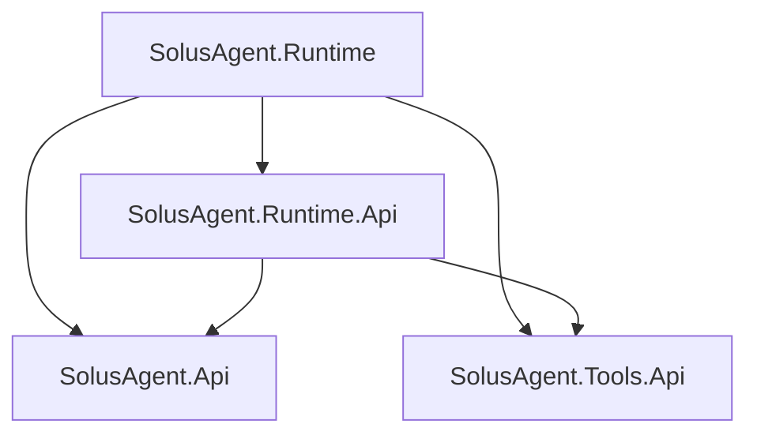

# Project structure

The four production libraries represent the boundaries explicitly selected for initialization. They are buildable skeletons, not implemented APIs. No placeholder public types, tests, providers, adapters, or generators are included.

## Layout

```text
SolusAgent.slnx
src/
    SolusAgent.Api/
    SolusAgent.Tools.Api/
    SolusAgent.Runtime.Api/
    SolusAgent.Runtime/
docs/
    00_project/
    10_workflow/
    20_architecture/
    50_ai/
    90_roadmap/
    shared/             # Pinned Solus Book submodule
```

Shared engineering guidance and its resources are loaded from the handbook submodule. [Shared handbook adoption](../00_project/shared-handbook.md) owns initialization and the selected revision; the remaining documentation directories retain project requirements.

The XML solution format follows ContractScribe's .NET solution layout. All four projects are ordinary `net10.0` libraries. Managed execution is the default; the shared build configuration does not require Native AOT or trimming.

## Assembly responsibilities

| Project / assembly / root namespace | Owns when implemented | Must not own |
| --- | --- | --- |
| `SolusAgent.Api` | Outer agent execution contracts, requests, results, events, usage, capabilities, and context envelopes. | A concrete runtime, model SDK, provider wire format, or mandatory tool registry. |
| `SolusAgent.Tools.Api` | Reusable function-tool definitions, metadata, input preparation, invocation, and result contracts. | A specific agent SDK, model provider, execution loop, or product evidence model. |
| `SolusAgent.Runtime.Api` | Self-owned runtime extension contracts, including model exchange, runtime configuration, and supported integration hooks. | Runtime execution implementation or product-specific review and documentation contracts. |
| `SolusAgent.Runtime` | Self-owned loop, per-run enforcement, context handling, and integration with shared tools and model providers. | Product result acceptance, campaign ownership, GitHub publication, or host storage policy. |

Project filenames and output DLLs use these exact names. Root namespaces and assembly names use the SDK defaults rather than separate aliases. Distribution metadata will be planned later.

## Reference graph

Arrows mean a direct project reference:



`SolusAgent.Api` and `SolusAgent.Tools.Api` have no project references or external package dependencies. Neither may reference `Runtime.Api` or `Runtime`. `Runtime.Api` may reference the two independent APIs, but must not reference the implementation.

Downstream product source, repository snapshots, fixtures, and machine-local paths must not become shared project references or linked build inputs.

## Downstream consumption

- Product agent orchestration depends on `SolusAgent.Api`.
- A reusable custom tool depends on `SolusAgent.Tools.Api`.
- A custom model provider for the self-owned runtime depends on `SolusAgent.Runtime.Api`.
- An application's startup layer selects a concrete agent implementation and supplies its configuration and tools. Using the self-owned implementation means loading `SolusAgent.Runtime` there, while the business layer receives the outer interface.
- Another agent implementation can depend on the outer API alone. If it supports shared custom tools, its integration can additionally depend on `Tools.Api` without referencing the self-owned runtime.

A single downstream project can begin with these source-level responsibilities. Separate downstream assemblies are useful when compilation must enforce the boundary, not simply to duplicate every directory as a project.

## Future project changes

Add a project only for a current independently useful dependency, implementation, or distribution boundary. Explain its classification, allowed references, new dependencies, affected consumers, and relevant validation.

Provider packages, additional agent implementations, tool implementations, generators, tests, and convenience hosting packages remain future work. The four initial skeletons do not imply that those packages are required for first implementation.
